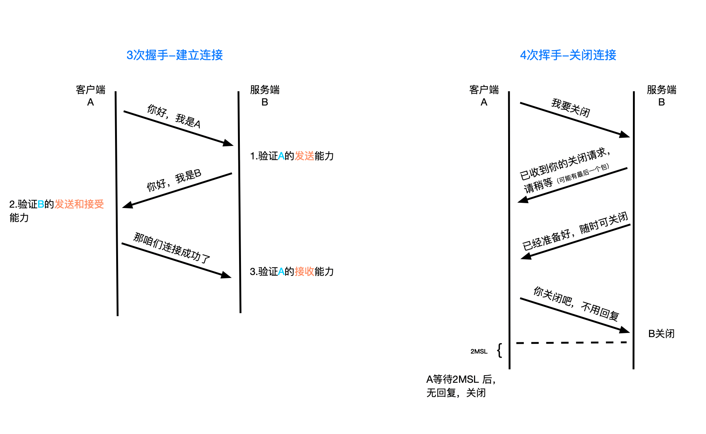

### 16: 談談你對TCP 三次握手和四次揮手的理解

#### 三次握手講解

1. 客戶端發送位碼為 sync=1, 隨機產生seq number=1234567 的數據包到服務器，服務器由 SYN=1知道客戶端要求建立聯繫
  (客戶端：我要聯繫你)
2. 服務器收到請求後要確認信息，向A發送 ack number=(客戶端的seq number+1), syn=1, ack=1, 隨機產生seq=7654321的包 
  (服務器：好的，你來連吧)
3. 客戶端收到後檢查ack number是否正確，即第一次發送的seq number +1, 以及位碼ack 是否為1, 若是正確，客戶端會在發送 ack number = (服務器的seq +1), ack=1，服務器收到確認seq值 與ack =1 則連接建立成功 
  (客戶端：好的，我來了)

### 為什麼http 建立連接需要三次握手，不是兩次或四次？
Ans: 三次是最少的安全次數，兩次不安全，四次浪費資源

### TCP 關閉連接過程

1. Client 向 Server 發送 FIN包，表示Client 主動要關閉連接，然後進入FIN_WAIT_1 狀態，等待Server 返回ACK 包，此後Client 不能再向Server 發送數據，但能讀取數據
2. Server 收到 FIN包後向Client 發送 ACK 包，然後進入CLOSE_WAIT 狀態，此後 Server 不再讀取數據，但可以繼續向Client 發送數據。
3. Client 收到Server 返回的 ACK 包後進入 FIN_WAIT_2 狀態，等待Server 發送FIN 包
4. Server 完成數據的發送後，將FIN包發送給Client，然後進入LAST_ACK 狀態，等待Client 返回ACK 包，此後Server 就不能再讀取數據，也不能發送數據
5. Client 收到FIN包後向Server 發送ACK 包，然後進入TIME_WAIT狀態，接著等待足夠長的時間(2MSL) 以確保Server 接收到ACK 包，最後回到CLOSED 狀態，釋放網路資源

### 為什麼要四次揮手？

TCP 是全雙工信道，何為全雙工就是客戶端與服務端建立兩條通道，
通道1: 客戶端的輸出連接服務端的輸入，
通道2: 客戶端的輸入連接服務端的輸出。兩個通道可以同時工作，客戶端項服務端發送信號的同時服務端也向客戶端發送信號。所以關閉雙通道的時候就是這樣

客戶端：我要關閉輸入通道了。
服務端：好的，你關閉吧。我這邊也關閉這個通道。

服務端：我也要關閉輸入通道了。
客戶端：好的你關閉吧，我也把這個通道關閉。

